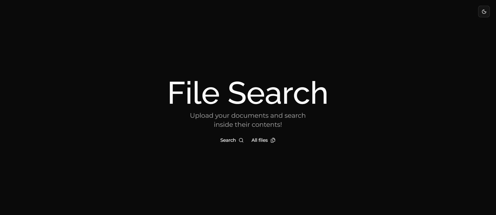
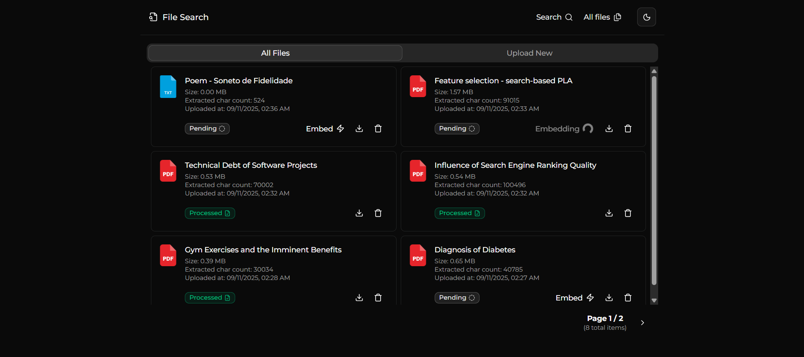
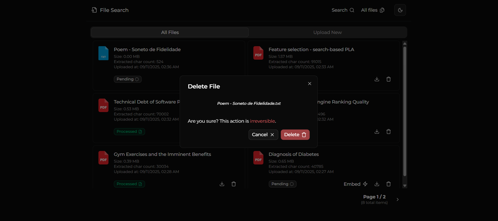
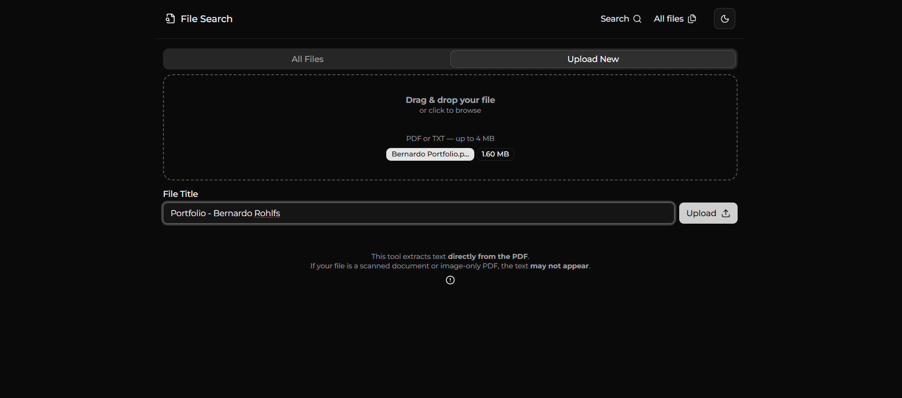
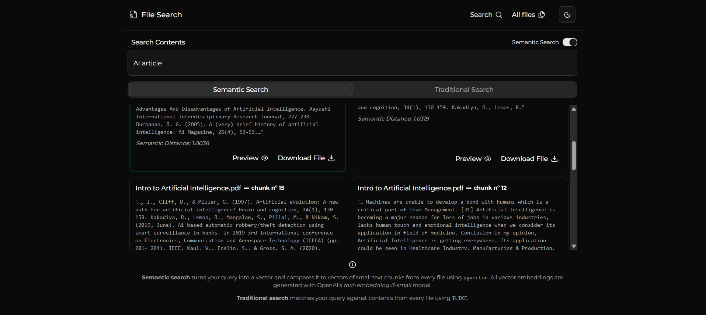
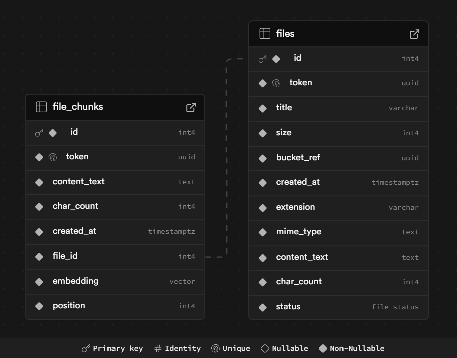

# 📄🔍 File Search App

This application allows users to **upload documents** — PDF or TXT — and **search their contents** via **traditional and semantic search** methods, with a smooth and intuitive experience.

---

## 📝 Functional Requirements

- Users must be able to switch themes (dark <=> light). ✅
- The front-end must implement smooth loading UIs. ✅
- Users must be able to upload PDF and TXT files — one at a time. ✅
- The front-end must allow file selection via drag and drop. ✅
- To upload, the user has to enter a title for the file with at least 5 characters. ✅
- The app must block uploads for files larger than 4MB. ✅
- The back-end must block uploads for unsupported file types or "text-empty" PDFs (image-only or scanned documents). ✅
- The back-end must extract and store the document's raw text content upon upload. ✅
- The back-end must sanitize the extracted text before storing it. ✅
- Files may have three statuses: "Pending" (after upload), "Processed" (after embedding), and "Failed" in case embedding fails. ✅
- The back-end must block embedding on files that aren't marked as "Pending". ✅
- The back-end must implement database transactions on multi-operation, indivisible tasks to ensure atomicity (e.g., a file upload or file deletion involves a database mutation and an S3 client request — either both happen or neither does). ✅
- The app must provide a listing page for all uploaded files, where users can request embedding for each file, as well as download or delete them. ✅
- The front-end must implement a 'confirm deletion modal' to ensure safety and avoid accidental deletions. ✅
- The 'Embed' button must appear only on "Pending" file cards. ✅
- The back-end must divide the file's raw text content into multiple chunks composed of around 300 tokens to ensure semantic precision while balancing context length. ✅
- All chunks must be embedded individually and have a vector and their raw text stored. ✅
- The app must implement pagination on the files page. ✅
- The app must offer a switch input to enable or disable semantic search. ✅
- The search bar must submit the search value to the back end after a short pause in typing (debounce). ✅
- The back-end must perform semantic content search by calculating the cosine distance between the embedded search value and the embedded file chunks. ✅
- The back-end must perform traditional content search via SQL's ILIKE operator. ✅
- The app must limit the number of result chunks to 6 for each approach (semantic and traditional). ✅
- On the search page, the front-end must provide a preview link for each chunk that points to its file's public URL.
- On the front-end, the semantic search tab must display the cosine distance for each chunk. ✅
- On the back-end, the semantic search must order the chunks by cosine distance. ✅
- The front-end must highlight the semantic search result with the best match (smallest distance to the search value). ✅

### Possible future implementations

- The app could offer an AI Chatbot to assist search. 🚧⏳
- The app could implement *OCR (Optical Character Recognition)* to allow image-only/scanned documents. 🚧⏳
- The app could allow upload for multiple files at once. 🚧⏳

---

## 🛠️ Tech Stack

### Language, Framework and Libraries

- TypeScript
- Next.js (full-stack web framework)
- Drizzle ORM
- `@aws-sdk/client-s3` (to manage object storage)
- Shadcn and Tailwind (for UI)
- `unpdf` (for PDF text extraction)
- `@langchain/textsplitters` (for chunk splitting by token count)
- `openai` (for embedding model usage)
- `pgvector` (to store and query embedded vectors inside PostgreSQL)
- `lucide-react` (icon collection)
- `next-themes` (for handling dark mode)
- React Hook Form and Zod (for form control and validation)
- `react-dropzone` (for handling drag and drop)
- `dayjs` (for date handling)
  
### Infrastructure and Architecture

#### ➤ Vercel 

Vercel offers a free plan (Hobby), perfect for hosting Next.js applications, especially MVPs and small projects. I chose to deploy this project there because it's extremely easy to configure. You just need to log in with your GitHub account, create a new project, and point it to the desired Git repository. This way, the CI/CD pipeline is automatically applied.

Vercel's Hobby plan also offers domain configuration, log visualization, caching, and a cron job feature!

#### ➤ Supabase

Supabase is a BaaS platform that is frequently used in projects via its SDK for managing SQL data, file storage, authentication, real-time features, and more. However, for this application, Next.js took the role of the back end, and Supabase's abstraction was somewhat dissolved. 

Instead of using its SDK, I accessed the Supabase Dashboard and grabbed the credentials and secrets of each service that I was going to use (PostgreSQL database and S3-compatible object storage), allowing me to use a more independent and robust ORM in Drizzle, and a universal S3 client in `@aws-sdk/client-s3`. This gave me more freedom, and it also allows me to eventually switch to new DB and storage providers without changing the source code!

#### ➤ OpenAI's API Platform

For this project, I needed an **embedding model** to vectorize the contents extracted from every uploaded file, allowing me to semantically search their contents by also embedding the search value. I chose OpenAI because I already had familiarity with some of its services, but I intend to explore new options in the future!

OpenAI offers two main embedding models as of the day I'm writing this paragraph — well, 3 if you include `text-embedding-ada-002`, but OpenAI explicitly recommends migrating to the `text-embedding-3` series for cost/performance. The two recommended current models are:

- `text-embedding-3-small`
- `text-embedding-3-large`

[Overview of available models.](https://platform.openai.com/docs/guides/embeddings/embedding-models?utm_source=chatgpt.com)  
[Benchmark numbers, pricing, and feature differences.](https://openai.com/index/new-embedding-models-and-api-updates/?utm_source=chatgpt.com)

I chose `text-embedding-3-small` for the following reasons:

- It is about 2 to 3 times faster per request than `3-large`.
- It is 6–7x cheaper than `3-large`.

The two main public benchmarks when comparing embedding models are **MTEB** (Massive Text Embedding Benchmark) and **MIRACL** (Multilingual Information Retrieval Across Languages). MTEB tests the model in about 50 different tasks across clustering, classification, semantic similarity, and more. MIRACL tests cross-lingual retrieval (measures performance when the query is in one language and the content is in another).

With that said, OpenAI has reported that the `3-large` model has shown a 25% improvement in MIRACL and only a 3.7% improvement in MTEB, in comparison to the `3-small` model.

This data helped me choose the `3-small` model, considering that for this project the great majority of uploaded files, as well as the searches, will be in English!

---

## ▶️ Demo

Click [here](https://filesearch.bernardorohlfs.com) to visit the demo, hosted on Vercel.

---

## 💻 Run locally

To run this project locally, besides needing **Node.js** installed on your machine, you will also need the following environment variables:

```
DATABASE_URL=""

ENDPOINT_S3=""
REGION_S3=""
ACCESS_KEY_ID=""
SECRET_ACCESS_KEY=""

OPEN_AI_API_KEY=""

SUPABASE_PUBLIC_FILES_URL=""
```

Now, clone this repository and run these commands:

```
cd my-app
npm install
npm run dev
```


---

## 🖼️ Pages and Features

### Home Page

Welcome! For the **home page**, I decided to go with a more minimalistic approach. I wanted the user to know exactly what this project is about immediately after arrival!



### Files Page

The **files page** displays the file catalog. The idea was to make this page as simple and straightforward as possible, elegant and subtle. The user can download or delete any file they want. Uploaded files enter the database with a 'Pending' status. This means the file has been stored, and its contents have already been extracted to raw text and saved; however, the text has yet to be embedded. 

That's where the **Embed** button comes in. When this button is clicked, the back end divides the file's raw text into multiple chunks of around 300 tokens and sends them to OpenAI's **text-embedding-3-small** model. OpenAI returns the vectorized representation of each chunk. The chunks are then stored as both raw text and vectors. After all this, the status changes to 'Processed'.



### Delete File Modal

The delete modal is a safety guard. It helps prevent accidental deletions by creating a layer of confirmation. When a user deletes a file, all stored data is deleted, including the vectorized chunks (via cascade) and the file copy (via a DB transaction).



### File Upload Page

The **file upload page** aims to offer high-quality UI. The drag-and-drop design brings familiarity and helps the user easily comprehend the use case. An input field lets the user overwrite the file's title by typing a new and more pleasant title. It's important to note that image-only/scanned PDFs cannot be uploaded, since their text cannot be extracted without *OCR (Optical Character Recognition)*, though this could be a cool feature in the future.



### Search Page

The **search page** is arguably the most important page of the application. It brings life to the website by providing its core feature: **file content searching**. 

The app implements two strategies: traditional search and semantic search.

| Method | How it works | Pros | Cons |
| --- | --- | --- | --- |
| Semantic Search | When a user types something in the search bar, the submitted search value, just like the files' chunks, is embedded. We then use PostgreSQL's `pgvector` extension to analyze and measure the semantic distance — cosine distance — between the search value and all the chunks in order to find the chunk with the best match. | Does not rely on exact matches. Allows the user to search for keywords, sentences, and ideas with freedom. | It's less precise with exact matches and can sometimes return irrelevant results. Besides, it adds cost and complexity. |
| Traditional Search | In this method, the search value is not embedded. Instead, the method matches the search value against all chunks' raw text contents using SQL's ILIKE operator. | Excellent with precise searches. Either the user gets exactly what they want, or nothing at all. It also offers more performance and lower complexity and cost. | Very strict. The user can't rely on semantic meaning to find content that is less clearly defined in their minds. | 

With all that said, the user can switch the **semantic search** option on and off whenever they please. They are also allowed to download or preview the file related to each chunk.




---

## 🗄️ ERD of the Database

The database itself is pretty simple. Two tables: `files` and `file_chunks`.



### The `files` Table

As I've mentioned, a new file row is created upon upload as 'Pending' — the status column is an enumerated type that can be 'Pending', 'Processed', or 'Failed'. In this same step, the file's raw text content is extracted and saved, and a copy is sent to an S3-compatible bucket called 'files'. The `files` table also immediately stores the following:

- `title`
- `size` (in bytes)
- `bucket ref` (points to the file copy stored in the S3 bucket)
- `extension`
- `mime_type`
- `content_text` (full extracted raw text)
- `char_count`

### The `file_chunks` Table

The **file_chunks** table gets new rows every time a user clicks on the 'Embed' button on the files page. Firstly, the chunks are created from the file's raw text content in memory, then sent to OpenAI's **text-embedding-3-small** model. After all embeddings are returned, all chunks are "bulk-inserted" into the database, storing raw text and vectors.
