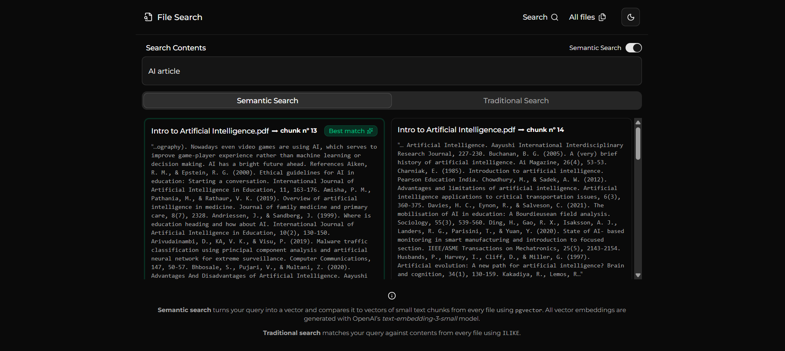

# 📄🔍 File Search App

This application allows users to upload documents and search inside their contents via traditional and semantic search methods, with a smooth and intuitive experience.

---

## 🛠️ Tech Stack

### Language, Framework and Libraries

- TypeScript
- Next.js (full-stack web framework)
- Drizzle ORM
- React Hook Form and Zod (for form validation)
- Shadcn (UI components)
  
### Infrastructure and Architecture

#### Vercel 


#### Supabase


#### OpenAI


---

## ▶️ Demo

Click [here](https://filesearch.bernardorohlfs.com) to visit the demo, hosted on Vercel.

---

## 💻 Run locally

To run this project locally, besides needing to have **Node.js** installed on your machine, you will also need the following environment variables:

```
DATABASE_URL=""

ENDPOINT_S3=""
REGION_S3=""
ACCESS_KEY_ID=""
SECRET_ACCESS_KEY=""

OPEN_AI_API_KEY=""

SUPABASE_PUBLIC_FILES_URL=""
```

Now, clone this repository and run these commands:

```
cd my-app
npm install
npm run dev
```

---

## 📝 Functional Requirements

- User must be able to upload PDF and TXT files. ✅
- System must provide upload option via drag and drop. ✅

for the future...

- System must offer an AI Chatbot to assist in search. 🚧⏳

---

## 🖼️ Pages and Features

### Home Page

Welcome! For the **home page**, I decided to go with a more minimalistic approach. I wanted the user to know exactly what this project is about imediately after arrival!


### Files Page

The **files page** displays the file catalog. The idea was to make this page as simple and straight forward as possible, elegant and subtle. The user can download or delete any file they want. Uploaded files enter the database with a 'Pending' status. This means the file has been stored, and it's contents have been already extracted to raw text and saved, however, the text is yet to be embedded. 

That's where to **Embed** button comes in. When this button is clicked, the backend divides the file's raw text into multiple chunks of around 300 tokens, and sends them to OpenAI's **text-embedding-3-small** model. Open AI returns the vectorized representation of each chunk. The chunks are then stored, as both raw text and vector. After all this, the status changes to 'Processed'.


### Delete File Modal

The delete modal is a safety guard. It helps prevent accidental deletions by creating a layer of confirmation. When a user deletes a file, all data stored is excluded, including the vectorized chunks (via cascade) and the file copy (via DB transaction).


### File Upload Page

The **file upload page** aims to offer high quality UI. The drag and drop design brings familiarity, and helps the user easily comprehend the use case. An input field was placed to overwrite the file's title. It allows the user to type a new and more pleasant title. It's important to note that scanned documents or image-only PDFs cannot be uploaded, since their text cannot be extracted without *OCR (Optical Character Recognition)*, tho this could be a cool feature in the future.


### Search Page

The **search page** is arguably the most important page of the application. It brings life to the website by providing it's core feature: **file content searching**. 

The app implements two strategies: traditional search and semantic search.

| Method | How it works | Pros | Cons |
| --- | --- | --- | --- |
| Semantic Search | When a user types something in the search bar, the submitted search value, just like the files' chunks, is embedded. We then use postgreSQL's `vector` extension to analyse and measure the semantic distance — Cosine distance — between the search value and all the chunks, in order the find the chunk with the best match. | Does not realy on exact match. Allows user to search for keywords, sentences and ideas with freedom. | It's less precise with exact matches and can sometimes return irrelevant results. Besides, it adds cost and complexity |
| Traditional Search | In this method, the search value is not embedded. Instead, the method matches the search value against all chunks' raw text contents using SQL's ILIKE operator | Excellent with precise searches. Either the user gets exactly what they want, or nothing at all. It also offers more perfomance and less complexity and cost. | Very strict. User can't rely on semantic meaning to find contents that looser in their heads. | 

With all that said, the user can switch the **semantic search** option on and off whenever they please. They are also allowed to download or preview the file related to each chunk.




---

## 🗄️ ERD of the Database

The database itself is pretty simple. Two tables: `files` and `file_chunks`.


### The `files` Table

As I've mentioned, a new file row is created upon upload as 'Pending' — the status column is an enumerated type that can be 'Pending', 'Processed' or 'Failed'. In this same step, the file's raw text content is extracted and saved, and a copy is sent to an S3 compatible bucket called 'files'. The `files` table also imediately stores the following:

- `title`
- `size` (in bytes)
- `bucket ref` (points to the file copy stored in the S3 bucket)
- `extension`
- `mime_type`
- `content_text` (full extracted raw text)
- `char_count`

### The `file_chunks` Table

The **file_chunks** table gets new rows everytime a user clicks on the 'Embed' button, on the files page. Firstly, the chunks are created from the file's raw text content, in memory, then sent to OpenAI's **text-embedding-3-small** model. After all embeddings are returned, all chunks are "bulk-inserted" into the database, storing raw text and vectors.


